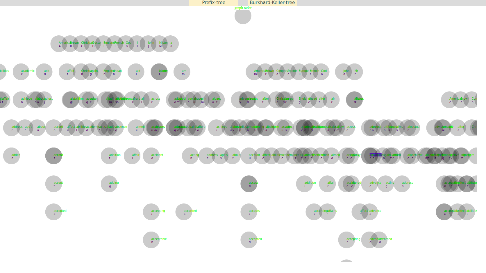
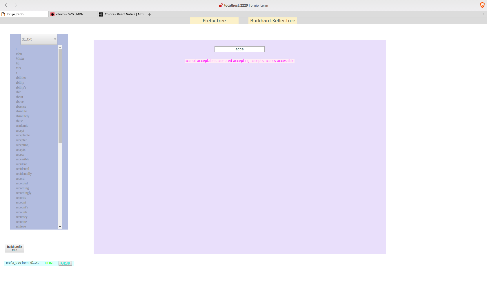

# Graph Radar

What started as an implementation of auto-complete and spell-check functionality has morphed into a data-structure laboratory.  At present there are implementations of char-wise (name ?) tree for autocomplete, and Burkhard-Keller tree for spellcheck.

There is a React app implementing an admin interface for building these structures from a choice of raw dictionaries, and prospectively there will be graphical navigation of these structures.  

[more...]

## Prerequisites:

- Tested on Ubuntu. This assumes a similar system.
- Node.js must be installed
- Redis must be installed, and the `redis-server` executable must be in `/usr/local/bin`.

    To accomplish this run `$ sudo cp redis-4.0.1/src/redis-server /usr/local/bin`,
    replacing the version number on the path as appropriate.


## Setup:

- clone the repo
- Install globally Nodemon and Coffee-Script with, respectively:
```bash
$    npm i -g nodemon
$    npm i -g coffee-script@next
```

## Startup:

There is now a startup stript in the root folder, so simply run:

- `$ coffee startup_dev.coffee`

- Open a browser to `localhost:2229`

This will give you four terminals, one with a watched webpack build of the brujo-term, one of the running dev-server, and two for redis servers. For development purposes, usually only the nodejs server and the webpack output matters.


### Manual Startup:

Typically one would need to restart individual processes, for example if need to flush one of the Redis servers, and test how the Nodejs server re-instantiates the base data-structures.

###### Nodejs server:

From `server-side` directory, `nodemon dev-server.coffee`


###### Webpack build:

From `brujo-terminal` directory, `webpack -w`


###### Redis servers:

e.g. from project root:

`redis-server ./redis_mgmt/main_redis.conf`

and

`redis-server ./redis_mgmt/worker_redis.conf`


##### previews ::
_eventually there will be some interactive graphics like this_



_and testing traversing functions (like autocomplete)_

